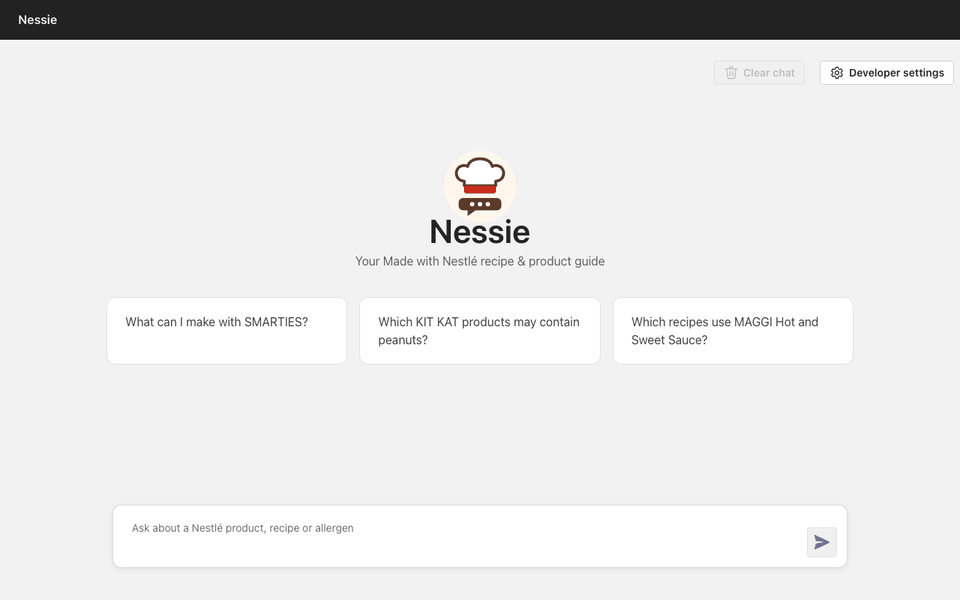

# Made with Nestlé AI Assistant

A chat assistant that answers questions about [Made with Nestlé](https://www.madewithnestle.ca/) products, recipes and help pages, with a citation to the source page for every claim. It combines vector search (RAG) with a small knowledge graph of brands, products, recipes, ingredients and allergens (GraphRAG).

**Live demo:** <https://app-backend-u6t5hmjsg6see.azurewebsites.net/>. The landing page has a pop-out chat button in the bottom-right corner. The full-page chat is at [`/#/chat`](https://app-backend-u6t5hmjsg6see.azurewebsites.net/#/chat).

> The demo runs on a free App Service plan, so the first request after a period of idleness can take 30–60 seconds while the app wakes up.



To re-record the demo after UI changes, run `python scripts/record_demo.py` (options: `--url`, `--question`, `--out`).

Try:

- *What can I make with Carnation hot chocolate?*
- *Which KIT KAT products may contain peanuts?*
- *Give me a recipe that uses KIT KAT.*
- *How do I contact Nestlé Canada consumer services?*

## Architecture

```text
madewithnestle.ca
   │  scripts/nestle/scrape.py            sitemap + allowlist, visible Chrome, rate-limited
   ▼
data/nestle/*.md  (693 pages, each with its Source URL)
   ├─► app/backend/prepdocs.py  ─────────► Azure AI Search index (chunks + embeddings)
   └─► scripts/nestle/extract_entities.py ► app/backend/graphrag/data/nestle_graph.json
                                             (1,149 nodes, 8,130 edges)
question
   │  query rewrite (Azure OpenAI)
   ├─► hybrid search over the index
   └─► graph: match entities → intersect / expand neighbors → linked pages + relationship facts
   ▼
Azure OpenAI answer, grounded in retrieved chunks + graph facts, with [page.md] citations
   ▼
React chat UI (pop-out widget or full page) → citation chips open the source page
```

| Layer | Technology |
| --- | --- |
| Scraping | Python, Playwright (real Chrome window), BeautifulSoup |
| Index | Azure AI Search (hybrid keyword + vector), `text-embedding-3-large` |
| Generation | Azure OpenAI `gpt-5.4-mini` |
| Graph | Rule-based extraction, in-memory graph loaded from JSON, `/graph` API |
| Backend | Python, Quart, deployed to Azure App Service |
| Frontend | React, TypeScript, Vite, Fluent UI |
| Infra | Bicep + Azure Developer CLI (`azd`) |

The app is built on [Azure-Samples/azure-search-openai-demo](https://github.com/Azure-Samples/azure-search-openai-demo). The Nestlé-specific parts are the scraper (`scripts/nestle/`), the GraphRAG module (`app/backend/graphrag/`), the graph step in `app/backend/approaches/chatreadretrieveread.py`, and the branded UI (`app/frontend/src/pages/home/`, `app/frontend/src/components/ChatWidget/`, `app/frontend/src/assistantConfig.ts`).

## Setup

Prerequisites: [Azure Developer CLI](https://aka.ms/azure-dev/install), Python 3.10+, Node.js 20+, Google Chrome (only for scraping), and an Azure subscription with Azure OpenAI access.

```shell
azd auth login
azd env new nestle
azd up                      # provisions OpenAI, AI Search, Storage, App Service; deploys the app
./scripts/prepdocs.sh       # indexes data/nestle/ into Azure AI Search
```

`azd up` prints the app URL when it finishes. To run locally against the same Azure resources:

```shell
PORT=50505 ./app/start.sh   # builds the frontend and serves everything on http://localhost:50505
```

Settings specific to this project (set with `azd env set`):

| Setting | Default | Purpose |
| --- | --- | --- |
| `USE_GRAPHRAG` | `true` | Load the knowledge graph and add the graph step to retrieval |
| `GRAPH_ADMIN_KEY` | empty | Enables `POST /graph/nodes` and `POST /graph/edges` when set |
| `VITE_ASSISTANT_NAME`, `VITE_ASSISTANT_ICON_URL`, `VITE_ASSISTANT_PRIMARY_COLOR`, … | see `assistantConfig.ts` | Assistant name, icon and colours, applied at frontend build time |

## Refreshing content

Content is refreshed on demand with one command:

```shell
./scripts/nestle/refresh.sh            # scrape → rebuild graph → re-index changed pages
azd deploy backend                     # ship the rebuilt graph to the live app
```

1. `scrape.py` reads the sitemap, keeps URLs matching `allow_patterns` in [`scripts/nestle/scrape_config.json`](scripts/nestle/scrape_config.json), and writes one Markdown file per page to `data/nestle/`. The site blocks headless browsers, so a Chrome window opens during the crawl. To re-extract Markdown from the saved HTML without contacting the site, run `python scripts/nestle/scrape.py --from-cache`.
2. `extract_entities.py` rebuilds `app/backend/graphrag/data/nestle_graph.json`. Nodes added through the API are kept separately in an overlay file, so a rebuild doesn't erase them.
3. `prepdocs.sh` re-indexes only pages whose content changed (tracked by `.md5` files).

To cover more of the site, add patterns to `allow_patterns` or URLs to `extra_urls`. Pages that disappear from the site are not removed from the index automatically. For a clean rebuild, run `./.venv/bin/python app/backend/prepdocs.py './data/*' --removeall` and then refresh. Scheduling is left to whatever runs the command (cron, a GitHub Actions schedule, or an Azure Container Apps job). The command needs a machine with Chrome and a display because of the bot protection.

## GraphRAG and how to extend it

The graph has five node types (`Brand`, `Product`, `Recipe`, `Ingredient`, `Allergen`) and eight edge types (for example `BELONGS_TO`, `USES_INGREDIENT`, `MAY_CONTAIN`, `RELATED_TO`). At question time, entities named in the question become seeds. For a brand plus an ingredient or allergen ("KIT KAT" + "peanuts"), the graph intersects them. Otherwise it expands each seed's neighbors. The pages linked to those entities are fetched from the search index, and relationship facts such as `KITKAT Chunky Peanut Butter CONTAINS_ALLERGEN peanuts [kit-kat__....md]` are added to the prompt. The *Thought process* tab in the UI shows the seeds, facts and linked pages for each answer.

Three ways to extend it:

- **Add data without code:** `POST /graph/nodes` and `POST /graph/edges` with an `X-Graph-Admin-Key` header. Additions are saved to an overlay file and used immediately.
- **Add an entity or edge type:** register it in `app/backend/graphrag/schema.py`, write an extractor function in `app/backend/graphrag/extract.py`, call it from `scripts/nestle/extract_entities.py`, and rebuild.
- **Tune matching:** brand aliases and the allergen list live in [`scripts/nestle/graph_config.json`](scripts/nestle/graph_config.json).

Full schema, API examples and design notes: [docs/graphrag.md](docs/graphrag.md).

## Evaluation

[`evals/nestle_smoke.py`](evals/nestle_smoke.py) runs 18 questions (14 about Nestlé content, 4 off-topic) against a running app, with GraphRAG off and on. It checks whether the answer cites a page from the right brand, whether it has an inline citation, whether it contains the expected keywords, and whether off-topic questions are declined.

Results against the live app (October 2026):

| Check | RAG | RAG + GraphRAG |
| --- | --- | --- |
| Answered the in-scope question | 14/14 | 14/14 |
| Cited a page from the right brand or section | 14/14 | 14/14 |
| Inline `[page.md]` citation in the answer | 14/14 | 14/14 |
| Expected keywords in the answer | 13/14 | 13/14 |
| Declined the off-topic question | 4/4 | 4/4 |

On these checks GraphRAG neither helps nor hurts, because plain retrieval already finds the right brand's pages for single-brand questions. Where the graph helps is in what the answer contains. For allergen questions it adds explicit facts (for example, which specific KIT KAT and DRUMSTICK products list peanuts), and it can pull in linked recipe pages that search alone ranks low. Misses worth knowing about: both modes left out AERO Peppermint when listing AERO flavours, and with GraphRAG on, the Carnation recipe question got a hedged answer instead of specific recipes.

Per-question results: [evals/results_summaries/nestle_smoke.md](evals/results_summaries/nestle_smoke.md). Raw answers: `evals/results/nestle-smoke/results.jsonl`. These are automatic checks, not human-graded answer quality, and 18 questions is a smoke test rather than a benchmark.

## Limitations

- **Coverage:** 693 pages from the sections in the allowlist; some site sections and anything rendered only in images are missing.
- **Graph extraction is rule-based.** It relies on the site's page structure ("Ingredients", "May contain:" blocks). A site redesign means updating the extractors, and recipes without structured ingredient lists produce fewer edges.
- **Refresh is manual** and needs a machine with Chrome, because the site blocks headless browsers. Removed pages need a full rebuild to leave the index.
- **The graph is in memory** and ships with the backend. It is fine at about 1k nodes; a much larger graph would need a graph database. Overlay additions made on the live App Service are lost if the app is redeployed.
- **Cost-constrained demo:** free App Service tier (slow cold start), the free Azure AI Search tier (no semantic ranker), and a low-capacity model deployment, so a burst of users can hit rate limits.
- **No authentication** on the demo; graph writes are protected only by the admin key.
- Allergen answers come from the website text and are not a substitute for reading the product label.

## Attribution

Application scaffold and Azure RAG patterns from [Azure-Samples/azure-search-openai-demo](https://github.com/Azure-Samples/azure-search-openai-demo) (MIT). Made with Nestlé content belongs to Nestlé and is used here for a technical assessment and demonstration only. See [LICENSE](LICENSE).
